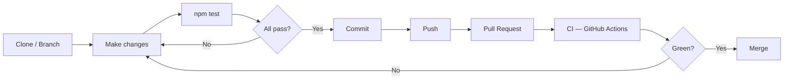

# Contributing to Fuel Price Analyzer

[](https://www.conventionalcommits.org)
[](https://www.typescriptlang.org)
[](https://jestjs.io)

Thank you for your interest in contributing to this project. This document
outlines the guidelines, standards, and workflow required to contribute
effectively, following the SOLID principles (Martin, 2003) and clean code
practices (Martin, 2009) applied throughout the codebase.

---

## Table of Contents

- [Contributing to Fuel Price Analyzer](#contributing-to-fuel-price-analyzer)
  - [Table of Contents](#table-of-contents)
  - [Pre-contribution Checklist](#pre-contribution-checklist)
  - [Getting Started](#getting-started)
  - [Development Environment](#development-environment)
  - [Project Standards](#project-standards)
    - [Naming conventions](#naming-conventions)
    - [Code style](#code-style)
    - [Adding new provinces or products](#adding-new-provinces-or-products)
    - [Adding a new chart style](#adding-a-new-chart-style)
  - [SOLID Principles](#solid-principles)
  - [Testing](#testing)
    - [Writing new tests](#writing-new-tests)
    - [Testing strategy](#testing-strategy)
  - [| `LineChartRenderer` | Unit test | Pure rendering logic |](#-linechartrenderer---unit-test--pure-rendering-logic--------------)
  - [Contribution Workflow](#contribution-workflow)
  - [Commit Guidelines](#commit-guidelines)
  - [References](#references)

---

## Pre-contribution Checklist

> [!NOTE]
> This checklist must be completed before every pull request, not just
> the first contribution.

- [ ] All existing tests pass (`npm test`)
- [ ] New functionality includes new tests
- [ ] Commits follow Conventional Commits format
- [ ] JSDoc added to all new public classes
- [ ] No magic numbers — constants defined in the class or `config.ts`
- [ ] No commented-out code — use Git history instead
- [ ] README updated if behaviour or structure changed

---

## Getting Started

1. Clone the repository:

```bash
git clone git@github.com:HuguitoH/AB-HHM-U20.git
cd AB-HHM-U20
```

2. Open in VSCode and reopen in the Dev Container:

```bash
code .
```

> [!TIP]
> If the container does not start automatically, press `F1` and select
> `Dev Containers: Reopen in Container` manually.

3. Navigate to the project folder:

```bash
cd FuelPriceAnalyzer
```

4. Verify everything works before making any changes:

```bash
npm test
npm run dev -- --date 21-05-2026
```

> [!TIP]
> Both commands must succeed before you start contributing. If either
> fails, check the [README](./README.md) for troubleshooting.

---

## Development Environment

This project uses a **Dev Container** based on `node:24-alpine` to ensure a
consistent environment across all contributors (Microsoft, 2026). All
required tools — Node.js, TypeScript, tsx, and Jest — are pre-installed
inside the container.

> [!WARNING]
> Do not develop outside the container. Running the project locally without
> Docker may produce different results due to environment differences.

The container is configured in `.devcontainer/devcontainer.json` and includes
the following VSCode extensions:

| Extension                            | Purpose                            |
| ------------------------------------ | ---------------------------------- |
| **ESLint**                           | Code linting                       |
| **Prettier**                         | Code formatting                    |
| **GitLens**                          | Git history and blame              |
| **Todo Tree**                        | Tracks `TODO` and `FIXME` comments |
| **Markdown Preview Mermaid Support** | Renders UML diagrams in README     |

---

## Project Standards

### Naming conventions

Following Martin (2009), all names must express intent clearly:

| Element    | Convention                 | Example                 |
| ---------- | -------------------------- | ----------------------- |
| Classes    | PascalCase                 | `StationParser`         |
| Interfaces | PascalCase with `I` prefix | `IDataFetcher`          |
| Methods    | camelCase, verb-first      | `parseSpanishFloat`     |
| Constants  | UPPER_SNAKE_CASE           | `BASE_URL`              |
| Files      | PascalCase for classes     | `ApiDataFetcher.ts`     |
| Test files | Match source file          | `StationParser.test.ts` |

### Code style

- **Small functions** — each function does exactly one thing.
- **No magic numbers** — use named constants defined in the class or `config.ts`.
- **Explicit error handling** — use typed custom errors, not generic `Error`.
- **No commented-out code** — use Git history instead.
- **JSDoc on all public classes** — document the why, not the what.

### Adding new provinces or products

The project follows the **Open/Closed Principle** (Martin, 2003) — to add a
new province or product, only `src/config.ts` needs to be modified:

```typescript
readonly provinces = [
  { name: "Madrid",   id: "28", apiName: "MADRID" },
  { name: "A Coruña", id: "15", apiName: "CORUÑA (A)" },
  { name: "Tenerife", id: "38", apiName: "SANTA CRUZ DE TENERIFE" },
  { name: "Badajoz",  id: "06", apiName: "BADAJOZ" },
  { name: "Sevilla",  id: "41", apiName: "SEVILLA" }, // ← add here only
] as const;
```

The `apiName` field must match the exact province name returned by the
all-Spain endpoint (`FiltroProducto`) — verify it by inspecting a live API
response before adding a new province.

> [!NOTE]
> No other class needs to be modified — this is Open/Closed in practice.

### Adding a new chart style

The **Strategy Pattern** is applied to chart renderers — adding a new chart
style only requires:

1. Create a new class implementing `IChartRenderer` in `src/`:

```typescript
export class MyChartRenderer implements IChartRenderer {
  render(input: ChartInput): string {
    const data = input.weekly; // or input.daily for time series
    // ...
  }
}
```

2. Add a factory method to `AnalyzerFactory`:

```typescript
static createMyChartRenderer(): IChartRenderer {
  return new MyChartRenderer();
}
```

3. Add the option to `selectChartStyle()` in `src/cli/chartPrompt.ts`.

No existing renderer or orchestration code needs to be modified.

---

## SOLID Principles

All contributions must respect the SOLID principles applied in this project
(Martin, 2003):

| Principle                 | Requirement                                                                                                                                                                         |
| ------------------------- | ----------------------------------------------------------------------------------------------------------------------------------------------------------------------------------- |
| **Single Responsibility** | Each class must have exactly one reason to change. Do not add HTTP logic to `StationParser`, rendering logic to `WeeklyAnalyzer`, or file I/O outside `ChartWriter`/`ReportWriter`. |
| **Open/Closed**           | Extend behaviour through new classes or config changes, not by modifying existing classes.                                                                                          |
| **Liskov Substitution**   | Any new implementation of `IChartRenderer`, `IDataFetcher`, or `ICacheStore` must be fully interchangeable with the existing ones.                                                  |
| **Interface Segregation** | Keep interfaces small and focused. Do not add unrelated methods to existing interfaces.                                                                                             |
| **Dependency Inversion**  | New classes must depend on interfaces, not on concrete implementations. Wire dependencies through `AnalyzerFactory`.                                                                |

> [!IMPORTANT]
> All contributions must follow SOLID principles. A pull request that
> violates any of these principles will be rejected regardless of
> functionality.

---

## Testing

All contributions must include tests. Run the full test suite before opening
a pull request (Meta Platforms, 2026):

```bash
npm test
```

> [!WARNING]
> All existing tests must pass. A contribution that breaks existing tests
> will not be accepted.

### Writing new tests

- Test files must be placed in `tests/` and named after the source file:
  `StationParser.ts` → `StationParser.test.ts`.
- Each test must have a descriptive name explaining what it verifies.
- Tests must not depend on network access — use mock data for unit tests.
- Test only classes with pure logic. Classes that interact with external
  services (API, file system) must use Jest mocks or a temp directory.

Example of a well-structured test:

```typescript
test("calculates correct average for Tuesday with multiple weeks", () => {
  const result = analyzer.analyze(mockData, "1", "Gasolina 95 E5", "04-2026");
  expect(result.averagesByDay["Tue"]).toBe(1.5);
});
```

### Testing strategy

| Class                  | Test type                 | Reason                                                        |
| ---------------------- | ------------------------- | ------------------------------------------------------------- |
| `StationParser`        | Unit test                 | Pure logic, no external dependencies                          |
| `StationLoader`        | Unit test with Jest mocks | Depends on `IStationRepository` — mocked                      |
| `ReportGenerator`      | Unit test                 | Pure calculation logic, no external dependencies              |
| `ReportFormatter`      | Unit test                 | Pure formatting logic, no external dependencies               |
| `Config`               | Unit test                 | Singleton behaviour verification                              |
| `AnalyzerFactory`      | Unit test                 | Factory method contract verification — all 15 factory methods |
| `NoDataAvailableError` | Unit test                 | Custom error class verification                               |
| `WeeklyAnalyzer`       | Unit test                 | Pure aggregation logic — day-of-week grouping and averaging   |
| `FileCacheStore`       | Unit test                 | Cache read/write/persist logic with temp directory            |
| `AsciiChartRenderer`   | Unit test                 | Pure rendering logic — output string verification             |
| `SvgChartGenerator`    | Unit test                 | Pure SVG generation — markup structure verification           |
| `ApiDataFetcher`       | Integration test (future) | Depends on Ministry REST API                                  |
| `StationRepository`    | Integration test (future) | Depends on `IDataFetcher` and `IStationParser`                |
| `ReportWriter`         | Integration test (future) | Depends on file system                                        |
| `WeeklyDataFetcher`    | Integration test (future) | Depends on Ministry REST API and `ICacheStore`                |
| `DotPlotRenderer`      | Unit test                 | Pure rendering logic                                          |
| `LineChartRenderer`    | Unit test                 | Pure rendering logic                                          |

---

## Contribution Workflow



---

## Commit Guidelines

This project follows the **Conventional Commits** specification
(Conventional Commits, 2024). Every commit must follow this format:

```
<type>(<scope>): <short description in imperative>
```

**Valid types:**

| Type       | Use for                              |
| ---------- | ------------------------------------ |
| `feat`     | New functionality                    |
| `fix`      | Bug fix                              |
| `refactor` | Code change without behaviour change |
| `test`     | Adding or modifying tests            |
| `docs`     | Documentation only                   |
| `chore`    | Config, dependencies, tooling        |
| `ci`       | CI/CD pipeline changes               |

**Examples:**

```
feat(charts): implement AsciiChartRenderer with horizontal bar layout
fix(config): add apiName to provinces for correct Ministry API matching
test(weekly): add unit tests for WeeklyAnalyzer day-of-week grouping
docs(readme): update Quick Start table with --charts flag
refactor(factory): add Milestone 3 factory methods to AnalyzerFactory
ci: add GitHub Actions workflow for automated testing
```

> [!CAUTION]
> Never push directly to `main`. Always work on a feature branch and
> open a pull request. Direct pushes to main are not permitted.

**Rules:**

- Description in **English**, in **imperative** ("add", "fix" — not "added", "fixed")
- **One commit = one change** — do not mix unrelated changes in a single commit
- **No `WIP` commits** on the main branch

---

## References

Conventional Commits (2024) _Conventional Commits specification v1.0.0_.
Available at: https://www.conventionalcommits.org (Accessed: 23 May 2026).

Martin, R.C. (2003) _Agile Software Development: Principles, Patterns, and
Practices_. Upper Saddle River: Prentice Hall.

Martin, R.C. (2009) _Clean Code: A Handbook of Agile Software Craftsmanship_.
Upper Saddle River: Prentice Hall.

Meta Platforms (2026) _Jest: JavaScript Testing Framework_. Available at:
https://jestjs.io/docs/getting-started (Accessed: 23 May 2026).

Microsoft (2026) _Dev Containers documentation_. Available at:
https://code.visualstudio.com/docs/devcontainers/containers
(Accessed: 23 May 2026).

Gamma, E., Helm, R., Johnson, R. and Vlissides, J. (1994) _Design Patterns:
Elements of Reusable Object-Oriented Software_. Reading: Addison-Wesley
Professional.
