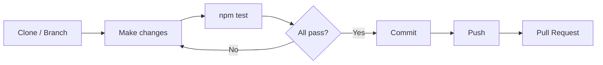

# Contributing to Fuel Price Analyzer

[](https://www.conventionalcommits.org)
[](https://www.typescriptlang.org)
[](https://jestjs.io)

Thank you for your interest in contributing to this project. This document
outlines the guidelines, standards, and workflow required to contribute
effectively, following the SOLID principles (Martin, 2003) and clean code
practices (Martin, 2009) applied throughout the codebase.

---

## Table of Contents

- [Contributing to Fuel Price Analyzer](#contributing-to-fuel-price-analyzer)
  - [Table of Contents](#table-of-contents)
  - [Pre-contribution Checklist](#pre-contribution-checklist)
  - [Getting Started](#getting-started)
  - [Development Environment](#development-environment)
  - [Project Standards](#project-standards)
    - [Naming conventions](#naming-conventions)
    - [Code style](#code-style)
    - [Adding new provinces or products](#adding-new-provinces-or-products)
  - [SOLID Principles](#solid-principles)
  - [Testing](#testing)
    - [Writing new tests](#writing-new-tests)
    - [Testing strategy](#testing-strategy)
  - [Contribution Workflow](#contribution-workflow)
  - [Commit Guidelines](#commit-guidelines)
  - [References](#references)

---

## Pre-contribution Checklist

> [!NOTE]
> This checklist must be completed before every pull request, not just
> the first contribution.

- [ ] All existing tests pass (`npm test`)
- [ ] New functionality includes new tests
- [ ] Commits follow Conventional Commits format
- [ ] JSDoc added to all new public classes
- [ ] No magic numbers — constants defined in `config.ts`
- [ ] No commented-out code — use Git history instead
- [ ] README updated if behaviour or structure changed

---

## Getting Started

1. Clone the repository:
```bash
git clone git@github.com:HuguitoH/AB-HHM-U20.git
cd AB-HHM-U20
```

2. Open in VSCode and reopen in the Dev Container:
```bash
code .
```

> [!TIP]
> If the container does not start automatically, press `F1` and select
> `Dev Containers: Reopen in Container` manually.

3. Navigate to the project folder:
```bash
cd FuelPriceAnalyzer
```

4. Verify everything works before making any changes:
```bash
npm test
npm run dev -- --date 21-03-2026
```

> [!TIP]
> Both commands must succeed before you start contributing. If either
> fails, check the [README](./README.md) for troubleshooting.

---

## Development Environment

This project uses a **Dev Container** based on `node:24-alpine` to ensure a
consistent environment across all contributors (Microsoft, 2026). All
required tools — Node.js, TypeScript, tsx, and Jest — are pre-installed
inside the container.

> [!WARNING]
> Do not develop outside the container. Running the project locally without
> Docker may produce different results due to environment differences.

The container is configured in `.devcontainer/devcontainer.json` and includes
the following VSCode extensions:

| Extension                            | Purpose                            |
| ------------------------------------ | ---------------------------------- |
| **ESLint**                           | Code linting                       |
| **Prettier**                         | Code formatting                    |
| **GitLens**                          | Git history and blame              |
| **Todo Tree**                        | Tracks `TODO` and `FIXME` comments |
| **Markdown Preview Mermaid Support** | Renders UML diagrams in README     |

---

## Project Standards

### Naming conventions

Following Martin (2009), all names must express intent clearly:

| Element    | Convention                 | Example                 |
| ---------- | -------------------------- | ----------------------- |
| Classes    | PascalCase                 | `StationParser`         |
| Interfaces | PascalCase with `I` prefix | `IDataFetcher`          |
| Methods    | camelCase, verb-first      | `parseSpanishFloat`     |
| Constants  | UPPER_SNAKE_CASE           | `BASE_URL`              |
| Files      | PascalCase for classes     | `ApiDataFetcher.ts`     |
| Test files | Match source file          | `StationParser.test.ts` |

### Code style

- **Small functions** — each function does exactly one thing.
- **No magic numbers** — use named constants from `config.ts`.
- **Explicit error handling** — use typed custom errors, not generic `Error`.
- **No commented-out code** — use Git history instead.
- **JSDoc on all public classes** — document the why, not the what.

### Adding new provinces or products

The project follows the **Open/Closed Principle** (Martin, 2003) — to add a
new province or product, only `src/config.ts` needs to be modified:
```typescript
export const PROVINCES = [
  { name: 'Madrid',   id: '28' },
  { name: 'A Coruña', id: '15' },
  { name: 'Tenerife', id: '38' },
  { name: 'Badajoz',  id: '06' },
  { name: 'Sevilla',  id: '41' }, // ← add here only
] as const;
```

> [!NOTE]
> No other class needs to be modified — this is Open/Closed in practice.

---

## SOLID Principles

All contributions must respect the SOLID principles applied in this project
(Martin, 2003):

| Principle                 | Requirement                                                                                                                       |
| ------------------------- | --------------------------------------------------------------------------------------------------------------------------------- |
| **Single Responsibility** | Each class must have exactly one reason to change. Do not add HTTP logic to `StationParser` or parsing logic to `ApiDataFetcher`. |
| **Open/Closed**           | Extend behaviour through new classes or config changes, not by modifying existing classes.                                        |
| **Liskov Substitution**   | Any new implementation of `IDataFetcher` or `IStationParser` must be fully interchangeable with the existing ones.                |
| **Interface Segregation** | Keep interfaces small and focused. Do not add unrelated methods to existing interfaces.                                           |
| **Dependency Inversion**  | New classes must depend on interfaces, not on concrete implementations.                                                           |

> [!IMPORTANT]
> All contributions must follow SOLID principles. A pull request that
> violates any of these principles will be rejected regardless of
> functionality.

---

## Testing

All contributions must include tests. Run the full test suite before opening
a pull request (Meta Platforms, 2026):
```bash
npm test
```

> [!WARNING]
> All existing tests must pass. A contribution that breaks existing tests
> will not be accepted.

### Writing new tests

- Test files must be placed in `tests/` and named after the source file:
  `StationParser.ts` → `StationParser.test.ts`.
- Each test must have a descriptive name explaining what it verifies.
- Tests must not depend on network access — use mock data for unit tests.
- Test only classes with pure logic. Classes that interact with external
  services must use Jest mocks.

Example of a well-structured test:
```typescript
test('parses PrecioProducto string with comma to number', () => {
  const [station] = parser.parse(mockRaw, '1', 'Gasolina 95 E5');
  expect(station?.price).toBe(1.859);
});
```

### Testing strategy

| Class               | Test type                 | Reason                                         |
| ------------------- | ------------------------- | ---------------------------------------------- |
| `StationParser`     | Unit test                 | Pure logic, no external dependencies           |
| `ApiDataFetcher`    | Integration test (future) | Depends on Ministry REST API                   |
| `StationRepository` | Integration test (future) | Depends on `IDataFetcher` and `IStationParser` |

---

## Contribution Workflow


---

## Commit Guidelines

This project follows the **Conventional Commits** specification
(Conventional Commits, 2024). Every commit must follow this format:
```
<type>(<scope>): <short description in imperative>
```

**Valid types:**

| Type       | Use for                              |
| ---------- | ------------------------------------ |
| `feat`     | New functionality                    |
| `fix`      | Bug fix                              |
| `refactor` | Code change without behaviour change |
| `test`     | Adding or modifying tests            |
| `docs`     | Documentation only                   |
| `chore`    | Config, dependencies, tooling        |

**Examples:**
```
feat(parser): add trim for trailing whitespace in locality field
fix(fetcher): handle 503 response from Ministry API
test(parser): add edge case for empty price string
docs(readme): update installation instructions
refactor(config): extract province IDs to named constants
chore(deps): update jest to 29.7.0
```

> [!CAUTION]
> Never push directly to `main`. Always work on a feature branch and
> open a pull request. Direct pushes to main are not permitted.

**Rules:**

- Description in **English**, in **imperative** ("add", "fix" — not "added", "fixed")
- **One commit = one change** — do not mix unrelated changes in a single commit
- **No `WIP` commits** on the main branch

---

## References

Conventional Commits (2024) *Conventional Commits specification v1.0.0*.
Available at: https://www.conventionalcommits.org (Accessed: 25 March 2026).

Martin, R.C. (2003) *Agile Software Development: Principles, Patterns, and
Practices*. Upper Saddle River: Prentice Hall.

Martin, R.C. (2009) *Clean Code: A Handbook of Agile Software Craftsmanship*.
Upper Saddle River: Prentice Hall.

Meta Platforms (2026) *Jest: JavaScript Testing Framework*. Available at:
https://jestjs.io/docs/getting-started (Accessed: 25 March 2026).

Microsoft (2026) *Dev Containers documentation*. Available at:
https://code.visualstudio.com/docs/devcontainers/containers
(Accessed: 25 March 2026).