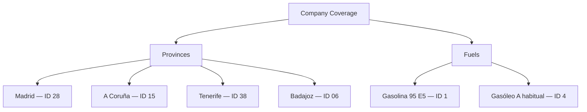
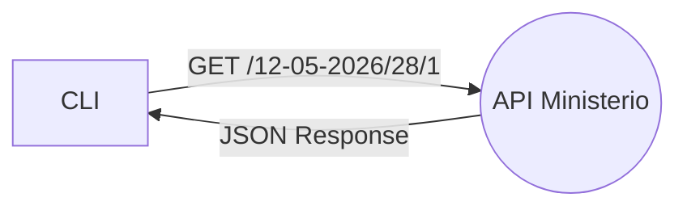
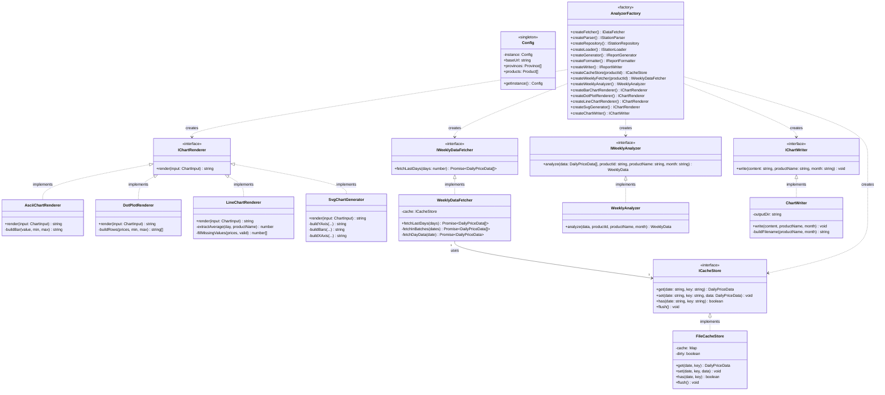

# Fuel Price Analyzer


A command-line tool that fetches and processes fuel price data from Spain's
Ministry of Ecological Transition REST API, generating daily reports and
weekly market intelligence charts for a fuel distribution company.

> This project is built on top of the base repository for Unit 20. The `DataReader/` folder contains an
> example code reader for CSV and has not been modified.

---

## Table of Contents

- [Fuel Price Analyzer](#fuel-price-analyzer)
  - [Table of Contents](#table-of-contents)
  - [Scenario](#scenario)
  - [Requirements](#requirements)
  - [Quick Start](#quick-start)
  - [Installation](#installation)
  - [Usage](#usage)
    - [Summary mode](#summary-mode)
    - [Report mode](#report-mode)
    - [Save report to file](#save-report-to-file)
    - [Charts mode](#charts-mode)
  - [Data Source](#data-source)
    - [Endpoints used](#endpoints-used)
    - [JSON response structure](#json-response-structure)
    - [Known API limitations](#known-api-limitations)
  - [Architecture](#architecture)
    - [SOLID principles applied](#solid-principles-applied)
    - [Clean code practices applied](#clean-code-practices-applied)
    - [Design patterns applied](#design-patterns-applied)
    - [UML Diagram](#uml-diagram)
    - [Data flow](#data-flow)
  - [Project Structure](#project-structure)
  - [Testing](#testing)
    - [Test strategy](#test-strategy)
  - [References](#references)

---

## Scenario

This project is developed for the IT department of a fuel distribution company
that operates several service stations across Spain. The company requires
software to process fuel price data published by the _Ministerio para la
Transición Ecológica y el Reto Demográfico_, in order to support pricing
policy decisions and market analysis (Ministerio para la Transición Ecológica
y el Reto Demográfico, 2026).

The company has presence in the following provinces and fuel types:



The software is delivered in three milestones:

- **Milestone 1** — Fetch and parse fuel price data from the Ministry REST API
  into typed data structures and load them into memory.
- **Milestone 2** — Generate a daily report with average prices and top 5
  cheapest/most expensive stations per fuel and province.
- **Milestone 3** — Generate bar charts showing average price per day of the
  week over the last month, for each fuel type across the studied provinces.

---

## Requirements

- [Docker Desktop](https://www.docker.com/products/docker-desktop/)
- [Visual Studio Code](https://code.visualstudio.com/)
- VSCode extension: **Dev Containers** (`ms-vscode-remote.remote-containers`)

No local Node.js installation is required. All dependencies run inside the
Dev Container, which is based on `node:24-alpine`.

---

## Quick Start

| Command                                                   | Description                         |
| --------------------------------------------------------- | ----------------------------------- |
| `npm run dev -- --date 21-05-2026`                        | Summary mode — stations loaded      |
| `npm run dev`                                             | Summary mode for today              |
| `npm run dev -- --date 21-05-2026 --report`               | Full report with averages and top 5 |
| `npm run dev -- --date 21-05-2026 --report --save-report` | Report + save to `reports/`         |
| `npm run dev -- --charts`                                 | Weekly charts for current month     |
| `npm run dev -- --charts --month 04-2026`                 | Weekly charts for a specific month  |
| `npm run build`                                           | Compile TypeScript to `dist/`       |
| `npm start -- --date 21-05-2026`                          | Run compiled version                |
| `npm test`                                                | Run test suite (83 tests)           |

---

## Installation

1. Clone the repository:

```bash
git clone git@github.com:HuguitoH/AB-HHM-U20.git
cd AB-HHM-U20
```

2. Open the project in VSCode:

```bash
code .
```

3. When prompted, click **Reopen in Container**. Alternatively, press `F1`
   and select `Dev Containers: Reopen in Container`.

4. Dependencies are installed automatically via `postCreateCommand`. Once the
   container is ready, you can run the program immediately.

---

## Usage

> [!NOTE]
> The Ministry API publishes data with a 1-2 day delay.
> If you get a "No data available" message, try with a recent past date.

Navigate to the project folder inside the container:

```bash
cd FuelPriceAnalyzer
```

### Summary mode

Shows a quick overview of loaded stations per province and fuel type:

```bash
npm run dev -- --date 12-05-2026
```

Expected output:

```
Fuel Price Analyzer — date: 12-05-2026

[Madrid / Gasolina 95 E5]
  Total stations: 851
  First: REPSOL | CARRETERA M-114 KM. 0,7 | 1.595 €/L

[Madrid / Gasóleo A habitual]
  Total stations: 857
  First: REPSOL | CARRETERA M-114 KM. 0,7 | 1.719 €/L
...
```

### Report mode

Generates a full paginated report with average prices and top 5 cheapest/most
expensive stations. An interactive mode selector is shown before the report:

```bash
npm run dev -- --date 12-05-2026 --report
```

```
  Report mode:
  [1] All stations (includes highways)
  [2] Exclude highway stations

  Select [1/2]:
```

The report is then displayed page by page:

```
============================================================
  FUEL PRICE REPORT — 12-05-2026
  Mode: All stations
============================================================

>>> Madrid / Gasolina 95 E5
------------------------------------------------------------
  Average price: 1.553 €/L

  ▼ Top 5 cheapest:
    1. PLENERGY                       1.365 €/L — CAMINO DEL OLIVO, 1, MECO
    2. GASEXPRESS                     1.369 €/L — CARRETERA DAGANZO KM. 3, ALCALA DE HENARES
    3. ALCAMPO                        1.369 €/L — C.C. LA DEHESA, ALCALA DE HENARES
    4. PETROPRIX                      1.369 €/L — CALLE ISAAC NEWTON, 155, ALCALA DE HENARES
    5. SUPECO                         1.369 €/L — POLIGONO LA GARENA, ALCALA DE HENARES

  ▲ Top 5 most expensive:
    1. COMERCIAL SAMA                 1.859 €/L — CALLE ANTONIO LÓPEZ, 8, MADRID
    2. REPSOL                         1.759 €/L — CARRETERA R-5 KM. 5,5, LEGANES
    ...

  Page 1/8
  [ENTER] next   [B] back   [Q] quit
```

Navigation:

- `ENTER` or `→` — next page
- `B` or `←` — previous page
- `Q` or `Ctrl+C` — quit

### Save report to file

Add `--save-report` to save the report as a `.txt` file in `reports/`:

```bash
npm run dev -- --date 12-05-2026 --report --save-report
```

Files are saved as `reports/report-DD-MM-YYYY-all.txt` or
`reports/report-DD-MM-YYYY-no-highway.txt` depending on the selected mode.

If the requested date has no data yet:

```
Fuel Price Analyzer — date: 24-03-2026

No data available for 24-03-2026.
The Ministry API publishes data with a 1-2 day delay.
Try: npm run dev -- --date DD-MM-YYYY
```

### Charts mode

Generates weekly price charts showing the average price per day of the week
over the last 30 days, for each fuel type across all studied provinces.
An SVG bar chart image is always saved to `charts/` for each fuel type.
An interactive chart style selector is shown before rendering:

```bash
npm run dev -- --charts
npm run dev -- --charts --month 04-2026
```

```
  Chart style:
  [1] Horizontal bars  — compare prices day by day
  [2] Dot plot         — see price spread across the week
  [3] Line chart       — see 30-day price trend

  Select [1/2/3]:
```

**Horizontal bars** — shows the average price per day of the week as
horizontal bars. The bar length is proportional to how far above the
weekly minimum each day's price is. This is the primary visualisation
and matches the SVG output:

```
============================================================
  WEEKLY CHART — Gasolina 95 E5 — 04-2026
  Mode: Horizontal bars
============================================================

  Day  |                        | Price
  -----|------------------------|-------
  Mon  |███████████████         | 1.530 €/L

  Tue  |████████████████████████| 1.532 €/L

  Wed  |████████                | 1.527 €/L

  Thu  |█████████████           | 1.529 €/L

  Fri  |                        | 1.524 €/L

  Sat  |██████                  | 1.526 €/L

  Sun  |████████                | 1.527 €/L

  -----|------------------------|-------

  Min: 1.524 €/L (Fri)   Max: 1.532 €/L (Tue)
============================================================
```

**Dot plot** — shows the same weekly averages as positioned dots,
useful for visualising the spread across days of the week.

**Line chart** — shows the full 30-day price evolution as a time series,
useful for spotting price trends over the month.

SVG charts are saved automatically to `charts/` on every run:

```
charts/chart-gasolina-95-e5-04-2026.svg
charts/chart-gasleo-a-habitual-04-2026.svg
```

---

## Data Source

The fuel price data is provided by the **Ministerio para la Transición
Ecológica y el Reto Demográfico** through a public REST API with no
authentication required.

The Ministry's website (`geoportalgasolineras.es`) offers CSV and XLS
downloads, but **does not provide a downloadable JSON file**. The only
way to obtain data in JSON format is through the REST API directly, as
confirmed by the API documentation (Ministerio para la Transición Ecológica
y el Reto Demográfico, 2026).

Full API documentation:

```
https://energia.serviciosmin.gob.es/ServiciosRestCarburantes/PreciosCarburantes/help
```

### Endpoints used

**Historical prices by province and product (Milestones 1 & 2):**

```
GET /EstacionesTerrestresHist/FiltroProvinciaProducto/{FECHA}/{IDProvincia}/{IDProducto}
```

Example — Madrid, Gasolina 95 E5, 12 May 2026:

```
https://energia.serviciosmin.gob.es/ServiciosRestCarburantes/PreciosCarburantes/EstacionesTerrestresHist/FiltroProvinciaProducto/12-05-2026/28/1
```

**Historical prices by product across all Spain (Milestone 3):**

```
GET /EstacionesTerrestresHist/FiltroProducto/{FECHA}/{IDProducto}
```

Used to fetch 30 days of data in batches of 5. Results are filtered
in memory by province `apiName` to avoid 240 separate API calls
(30 days × 2 products × 4 provinces), reducing the total to 60 calls
(30 days × 2 products).



**Province and product ID lookup:**

```
GET /Listados/Provincias/
GET /Listados/ProductosPetroliferos/
```

### JSON response structure

```json
{
  "Fecha": "12/05/2026 0:00:00",
  "ListaEESSPrecio": [
    {
      "C.P.": "28864",
      "Dirección": "CARRETERA M-114 KM. 0,7",
      "Horario": "L: 06:00-00:00",
      "Latitud": "40,528028",
      "Localidad": "AJALVIR",
      "Longitud (WGS84)": "-3,480944",
      "Municipio": "Ajalvir",
      "PrecioProducto": "1,595",
      "Provincia": "MADRID",
      "Rótulo": "REPSOL",
      "IDEESS": "3119",
      "IDMunicipio": "4277",
      "IDProvincia": "28",
      "IDCCAA": "13"
    }
  ],
  "ResultadoConsulta": "OK"
}
```

**Parsing notes:**

- `PrecioProducto`, `Latitud` and `Longitud` use **comma as decimal separator**
  and must be converted to `number` (e.g. `"1,595"` → `1.595`).
- `Localidad` may contain **trailing whitespace** and must be trimmed.
- Stations with an **empty `PrecioProducto`** do not sell that fuel and
  must be filtered out before processing.
- The `Fecha` field is in the **root response object**, not in each station,
  and must be propagated to each `Station` during parsing.
- Province names in the all-Spain endpoint use the Ministry's own naming
  convention: `"CORUÑA (A)"` and `"SANTA CRUZ DE TENERIFE"` — matched via
  the `apiName` field in `config.ts`.

### Known API limitations

> [!CAUTION]
> The API returns XML by default. Always include the `Accept: application/json`
> header in all requests, or responses will be unparseable.

- Data is published with a **1-2 day delay** — today's prices are not
  available until the following day.
- The API returns **XML by default** — the `Accept: application/json` header
  is required for JSON responses.
- The field `IDPovincia` in `/Listados/Provincias/` contains a **typo**
  (missing second `r`) — this is a known bug in the Ministry API.
- Numeric fields use **comma as decimal separator** instead of period, which
  is non-standard JSON.
- Some physical stations are registered as **multiple entries** with different
  IDs but identical address and locality — these are deduplicated before
  report generation.
- The all-Spain endpoint returns province names in a non-standard format
  that differs from the display names — `apiName` in `config.ts` maps
  each province to its exact Ministry API name.

---

## Architecture

The project is designed following the **SOLID principles** (Martin, 2003),
**clean code** practices (Martin, 2009), and **design patterns** (Gamma et
al., 1994).

### SOLID principles applied

| Principle                 | Application                                                                                                                                                                                                                                                                                                                                                          |
| ------------------------- | -------------------------------------------------------------------------------------------------------------------------------------------------------------------------------------------------------------------------------------------------------------------------------------------------------------------------------------------------------------------- |
| **Single Responsibility** | `StationParser` only transforms data. `ApiDataFetcher` only handles HTTP. `StationRepository` only orchestrates. `StationLoader` only builds the in-memory store. `ReportGenerator` only calculates. `ReportFormatter` only formats. `ReportWriter` only writes to file. `WeeklyAnalyzer` only computes day-of-week averages. `ChartWriter` only writes SVG to disk. |
| **Open/Closed**           | Adding a new province or product only requires updating `config.ts`. Adding a new chart style only requires implementing `IChartRenderer` — no existing class needs to be modified.                                                                                                                                                                                  |
| **Liskov Substitution**   | Any `IDataFetcher` implementation can replace `ApiDataFetcher`. Any `IChartRenderer` implementation (`AsciiChartRenderer`, `DotPlotRenderer`, `LineChartRenderer`, `SvgChartGenerator`) is fully interchangeable.                                                                                                                                                    |
| **Interface Segregation** | All interfaces are kept small and focused. `IChartRenderer` defines a single `render(input: ChartInput)` method — each renderer decides internally what to use from the input.                                                                                                                                                                                       |
| **Dependency Inversion**  | All classes depend on interfaces, not concrete implementations. `AnalyzerFactory` centralises construction. `runChartsMode` only knows `IChartRenderer` — never the concrete renderer class.                                                                                                                                                                         |

### Clean code practices applied

Following Martin (2009), the codebase applies:

- **Meaningful names** — `parseSpanishFloat`, `NoDataAvailableError`,
  `deduplicateByLocation`, `filterHighway`, `extractAverage`, `fillMissingValues`
  express intent without comments.
- **Small functions** — each method does exactly one thing.
- **No magic numbers** — all province IDs, product IDs, API names, chart
  dimensions and bar widths are named constants.
- **Explicit error handling** — `NoDataAvailableError` distinguishes expected
  API behaviour (no data yet) from unexpected errors (network failure, etc.).
- **DRY** — date utilities extracted to `src/utils/date.ts`, CLI presentation
  extracted to `src/cli/`, `ChartInput` type shared across all renderers.

### Design patterns applied

Following Gamma et al. (1994), the following patterns are applied:

| Pattern              | Type        | Application                                                                                                              |
| -------------------- | ----------- | ------------------------------------------------------------------------------------------------------------------------ |
| **Singleton**        | Creational  | `Config` — guarantees a single instance of application configuration                                                     |
| **Factory Method**   | Creational  | `AnalyzerFactory` — centralises object creation, decoupling `index.ts` from all concrete implementations                 |
| **Repository**       | Structural  | `StationRepository` — abstracts data access behind a clean interface                                                     |
| **Strategy**         | Behavioural | `IChartRenderer` — `AsciiChartRenderer`, `DotPlotRenderer`, `LineChartRenderer` are interchangeable rendering algorithms |
| **Facade**           | Structural  | `StationLoader` — simplifies the fetch+parse pipeline behind a single `load()` method                                    |
| **Cache-Aside**      | Behavioural | `FileCacheStore` — checks cache before hitting the API; persists to JSON files between runs                              |
| **Batch Processing** | Behavioural | `WeeklyDataFetcher` — fetches 30 days in batches of 5 with 200ms delay to avoid overwhelming the Ministry API            |

### UML Diagram



### Data flow

```
CLI (index.ts)
    │
    ├── AnalyzerFactory.createLoader()
    │
    └── StationLoader.load(date)
            │
            └── per province × product (8 combinations):
                  └── StationRepository.getByProvinceAndProduct()
                        ├── ApiDataFetcher.fetch() → GET Ministry REST API
                        │       └── RawApiResponse (JSON)
                        └── StationParser.parse()
                                ├── filter: remove empty PrecioProducto
                                ├── map: RawStationData → Station
                                │     ├── parseSpanishFloat("1,595") → 1.595
                                │     ├── trim("AJALVIR   ") → "AJALVIR"
                                │     └── parseDate("12/05/2026 0:00:00") → Date
                                └── Station[]
            │
            └── StationStore (in-memory)

  [--report flag]
    │
    ├── selectReportMode() → 'all' | 'no-highway'
    │
    ├── ReportGenerator.generate(store, date, mode)
    │       ├── deduplicateByLocation()
    │       ├── filterHighway() [if no-highway]
    │       ├── calculateAverage()
    │       └── getTopN(5, asc) + getTopN(5, desc)
    │       └── ReportData
    │
    ├── ReportFormatter.formatPages(data) → string[]
    │
    ├── ReportWriter.write() [if --save-report]
    │       └── reports/report-DD-MM-YYYY-{mode}.txt
    │
    └── paginateReport(pages) → interactive console

  [--charts flag]
    │
    ├── selectChartStyle() → IChartRenderer
    │
    └── per product (2 iterations):
          ├── WeeklyDataFetcher.fetchLastDays(30)
          │       ├── FileCacheStore.get() → cache hit → DailyPriceData
          │       └── GET /FiltroProducto/{date}/{productId} → cache miss
          │               └── filter by province.apiName in memory
          │               └── FileCacheStore.set() + flush()
          │
          ├── WeeklyAnalyzer.analyze()
          │       ├── group DailyPriceData by dayOfWeek
          │       └── calculate average per day across all provinces
          │       └── WeeklyData { averagesByDay, sampleCount }
          │
          ├── IChartRenderer.render({ weekly, daily })
          │       ├── AsciiChartRenderer → horizontal bar chart string
          │       ├── DotPlotRenderer    → dot plot string
          │       └── LineChartRenderer  → 30-day time series string
          │
          ├── SvgChartGenerator.render({ weekly, daily })
          │       └── pure SVG bar chart string
          │
          └── ChartWriter.write()
                  └── charts/chart-{slug}-{month}.svg
```

---

## Project Structure

```
AB-HHM-U20/
├── .devcontainer/                  # Docker + VSCode container config
├── .github/
│   └── workflows/
│       └── ci.yml                  # GitHub Actions CI — runs npm test on push
├── DataReader/                     # Base example provided by MSMK (unmodified)
├── FuelPriceAnalyzer/              # Main project
│   ├── src/
│   │   ├── index.ts                # CLI entry point — orchestration only
│   │   ├── config.ts               # Config Singleton — provinces, products, base URL
│   │   ├── AnalyzerFactory.ts      # Factory Method — creates all components
│   │   ├── ApiDataFetcher.ts       # REST API client (HTTP only)
│   │   ├── StationParser.ts        # JSON → Station[] transformer
│   │   ├── StationRepository.ts    # Orchestrates fetch + parse
│   │   ├── StationLoader.ts        # Builds in-memory StationStore (Facade)
│   │   ├── ReportGenerator.ts      # Calculates averages and top 5
│   │   ├── ReportFormatter.ts      # Formats report for display
│   │   ├── ReportWriter.ts         # Saves report to file
│   │   ├── WeeklyDataFetcher.ts    # Fetches last 30 days in batches (Cache-Aside)
│   │   ├── WeeklyAnalyzer.ts       # Groups daily data by day of week
│   │   ├── FileCacheStore.ts       # JSON file cache for daily price data
│   │   ├── AsciiChartRenderer.ts   # Horizontal bar chart (Strategy)
│   │   ├── DotPlotRenderer.ts      # Dot plot chart (Strategy)
│   │   ├── LineChartRenderer.ts    # 30-day time series line chart (Strategy)
│   │   ├── SvgChartGenerator.ts    # Pure SVG bar chart generator
│   │   ├── ChartWriter.ts          # Saves SVG charts to disk
│   │   ├── cli/
│   │   │   ├── prompt.ts           # Interactive mode selection and pagination
│   │   │   ├── summary.ts          # Summary mode output
│   │   │   └── chartPrompt.ts      # Chart style selector and month argument parser
│   │   ├── errors/
│   │   │   └── NoDataAvailableError.ts
│   │   ├── interfaces/
│   │   │   ├── IDataFetcher.ts
│   │   │   ├── IStationParser.ts
│   │   │   ├── IStationRepository.ts
│   │   │   ├── IStationLoader.ts
│   │   │   ├── IReportGenerator.ts
│   │   │   ├── IReportFormatter.ts
│   │   │   ├── IReportWriter.ts
│   │   │   ├── IChartRender.ts     # ChartInput type + IChartRenderer interface
│   │   │   ├── ICacheStore.ts
│   │   │   ├── IWeeklyDataFetcher.ts
│   │   │   ├── IWeeklyAnalyzer.ts
│   │   │   └── IChartWriter.ts
│   │   ├── types/
│   │   │   ├── raw.ts              # Raw API response types
│   │   │   ├── station.ts          # Clean internal domain model
│   │   │   ├── stationStore.ts     # In-memory store type
│   │   │   ├── report.ts           # Report types and ReportMode
│   │   │   └── weekly.ts           # DailyPriceData, WeeklyData, DayOfWeek
│   │   └── utils/
│   │       └── date.ts             # Date formatting utilities
│   ├── tests/
│   │   ├── StationParser.test.ts
│   │   ├── StationLoader.test.ts
│   │   ├── ReportGenerator.test.ts
│   │   ├── ReportFormatter.test.ts
│   │   ├── Config.test.ts
│   │   ├── AnalyzerFactory.test.ts
│   │   ├── NoDataAvailableError.test.ts
│   │   ├── WeeklyAnalyzer.test.ts
│   │   ├── FileCacheStore.test.ts
│   │   ├── AsciiChartRenderer.test.ts
│   │   └── SvgChartGenerator.test.ts
│   ├── package.json
│   └── tsconfig.json
├── .gitignore
├── CONTRIBUTING.md
└── README.md
```

---

## Testing

Tests are written with **Jest** and **ts-jest** following the AAA pattern
(Arrange, Act, Assert) as described in the course materials. Unit tests use
Jest mocks to isolate each class from its dependencies (Meta Platforms, 2026).

> [!IMPORTANT]
> Tests must pass before any contribution is accepted. Run `npm test`
> inside the Dev Container, not locally.

Run the full test suite:

```bash
npm test
```

Current test results:

```
Test Suites: 13 passed, 13 total
Tests:       72 passed, 72 total
```

### Test strategy

| Class                  | Test type                 | Reason                                                        |
| ---------------------- | ------------------------- | ------------------------------------------------------------- |
| `StationParser`        | Unit test                 | Pure logic, no external dependencies                          |
| `StationLoader`        | Unit test with Jest mocks | Depends on `IStationRepository` — mocked                      |
| `ReportGenerator`      | Unit test                 | Pure calculation logic, no external dependencies              |
| `ReportFormatter`      | Unit test                 | Pure formatting logic, no external dependencies               |
| `Config`               | Unit test                 | Singleton behaviour verification                              |
| `AnalyzerFactory`      | Unit test                 | Factory method contract verification — all 15 factory methods |
| `NoDataAvailableError` | Unit test                 | Custom error class verification                               |
| `WeeklyAnalyzer`       | Unit test                 | Pure aggregation logic — day-of-week grouping and averaging   |
| `FileCacheStore`       | Unit test                 | Cache read/write/persist logic with temp directory            |
| `AsciiChartRenderer`   | Unit test                 | Pure rendering logic — output string verification             |
| `SvgChartGenerator`    | Unit test                 | Pure SVG generation — markup structure verification           |
| `ApiDataFetcher`       | Integration test (future) | Depends on Ministry REST API                                  |
| `StationRepository`    | Integration test (future) | Depends on `IDataFetcher` and `IStationParser`                |
| `ReportWriter`         | Integration test (future) | Depends on file system                                        |
| `WeeklyDataFetcher`    | Integration test (future) | Depends on Ministry REST API and `ICacheStore`                |
| `DotPlotRenderer`      | Unit test                 | Pure rendering logic                                          |
| `LineChartRenderer`    | Unit test                 | Pure rendering logic                                          |

---

## References

Gamma, E., Helm, R., Johnson, R. and Vlissides, J. (1994) _Design Patterns:
Elements of Reusable Object-Oriented Software_. Reading: Addison-Wesley
Professional.

Martin, R.C. (2003) _Agile Software Development: Principles, Patterns, and
Practices_. Upper Saddle River: Prentice Hall.

Martin, R.C. (2009) _Clean Code: A Handbook of Agile Software Craftsmanship_.
Upper Saddle River: Prentice Hall.

Ministerio para la Transición Ecológica y el Reto Demográfico (2026)
_Servicio REST de Precios de Carburantes — Documentación de operaciones_.
Available at:
https://energia.serviciosmin.gob.es/ServiciosRestCarburantes/PreciosCarburantes/help
(Accessed: 23 May 2026).

Ministerio para la Transición Ecológica y el Reto Demográfico (2026)
_Listado de productos petrolíferos_. Available at:
https://energia.serviciosmin.gob.es/ServiciosRestCarburantes/PreciosCarburantes/Listados/ProductosPetroliferos/
(Accessed: 23 May 2026).

Ministerio para la Transición Ecológica y el Reto Demográfico (2026)
_Listado de provincias_. Available at:
https://energia.serviciosmin.gob.es/ServiciosRestCarburantes/PreciosCarburantes/Listados/Provincias/
(Accessed: 23 May 2026).

Meta Platforms (2026) _Jest: JavaScript Testing Framework_. Available at:
https://jestjs.io/docs/getting-started (Accessed: 23 May 2026).

Microsoft (2026) _TypeScript Documentation_. Available at:
https://www.typescriptlang.org/docs/ (Accessed: 23 May 2026).

Conventional Commits (2024) _Conventional Commits specification v1.0.0_.
Available at: https://www.conventionalcommits.org (Accessed: 23 May 2026).
