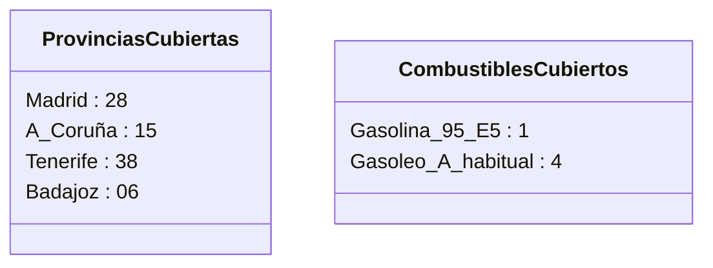
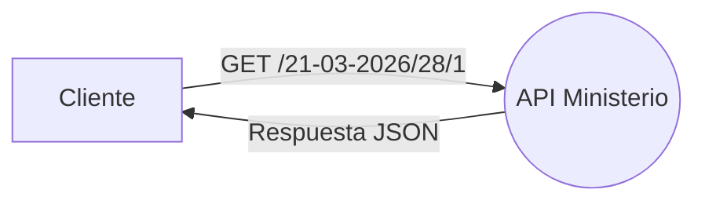
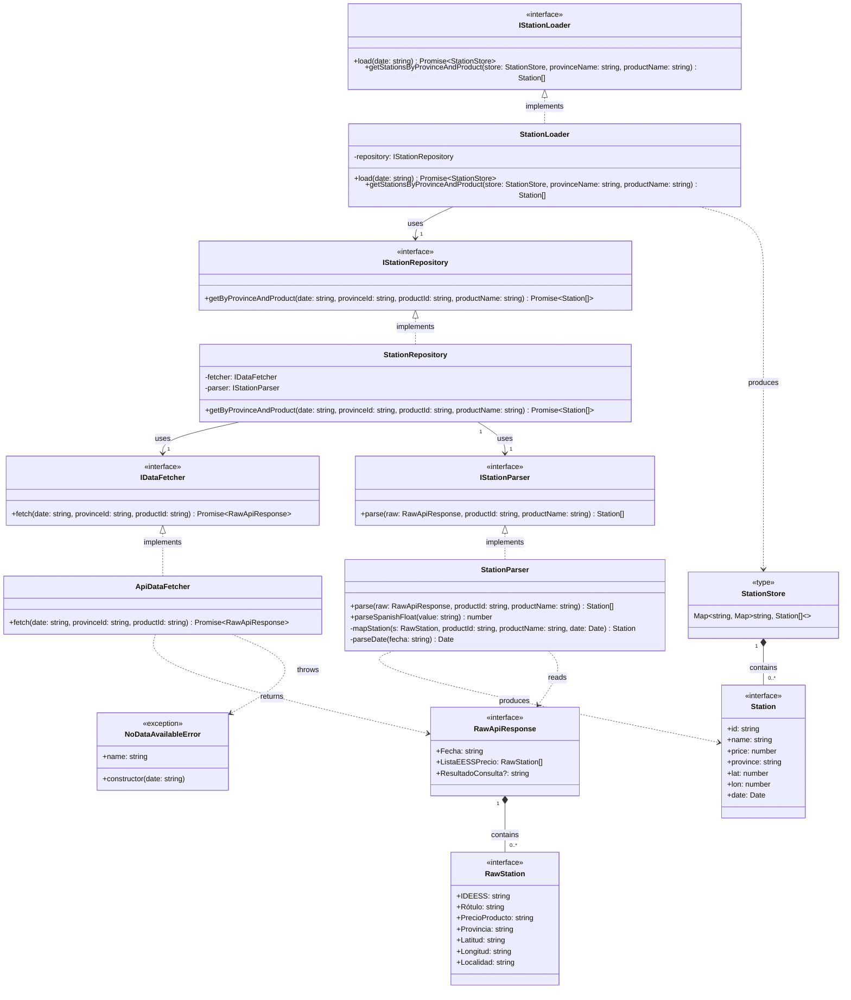

# Fuel Price Analyzer


A command-line tool that fetches and processes fuel price data from Spain's
Ministry of Ecological Transition REST API, generating daily reports and
market intelligence for a fuel distribution company.

> This project is built on top of the base repository for Unit 20. The `DataReader/` folder contains an
> example code reader for CSV and has not been modified.

---

## Table of Contents

- [Fuel Price Analyzer](#fuel-price-analyzer)
  - [Table of Contents](#table-of-contents)
  - [Scenario](#scenario)
  - [Requirements](#requirements)
  - [Quick Start](#quick-start)
  - [Installation](#installation)
  - [Usage](#usage)
  - [Data Source](#data-source)
    - [Endpoints used](#endpoints-used)
    - [JSON response structure](#json-response-structure)
    - [Known API limitations](#known-api-limitations)
  - [Architecture](#architecture)
    - [SOLID principles applied](#solid-principles-applied)
    - [Clean code practices applied](#clean-code-practices-applied)
    - [UML Diagram](#uml-diagram)
    - [Data flow](#data-flow)
  - [Project Structure](#project-structure)
  - [Testing](#testing)
  - [References](#references)

---

## Scenario

This project is developed for the IT department of a fuel distribution company
that operates several service stations across Spain. The company requires
software to process fuel price data published by the *Ministerio para la
Transición Ecológica y el Reto Demográfico*, in order to support pricing
policy decisions and market analysis (Ministerio para la Transición Ecológica
y el Reto Demográfico, 2026).

The company has presence in the following provinces and fuel types:


The software is delivered in three milestones:

- **Milestone 1** — Fetch and parse fuel price data from the Ministry REST API
  into typed data structures and load them into memory.
- **Milestone 2** — Generate a daily report with average prices and top 5
  cheapest/most expensive stations per fuel and province.
- **Milestone 3** — Generate bar charts showing average price per day of the
  week over the last month, for each fuel type across the studied provinces.

---

## Requirements

- [Docker Desktop](https://www.docker.com/products/docker-desktop/)
- [Visual Studio Code](https://code.visualstudio.com/)
- VSCode extension: **Dev Containers** (`ms-vscode-remote.remote-containers`)

No local Node.js installation is required. All dependencies run inside the
Dev Container, which is based on `node:24-alpine`.

---

## Quick Start

| Command                            | Description                   |
| ---------------------------------- | ----------------------------- |
| `npm run dev -- --date 21-03-2026` | Run for a specific date       |
| `npm run dev`                      | Run for today                 |
| `npm run build`                    | Compile TypeScript to `dist/` |
| `npm start -- --date 21-03-2026`   | Run compiled version          |
| `npm test`                         | Run test suite                |

---

## Installation

1. Clone the repository:
```bash
git clone git@github.com:HuguitoH/AB-HHM-U20.git
cd AB-HHM-U20
```

2. Open the project in VSCode:
```bash
code .
```

3. When prompted, click **Reopen in Container**. Alternatively, press `F1`
   and select `Dev Containers: Reopen in Container`.

4. Dependencies are installed automatically via `postCreateCommand`. Once the
   container is ready, you can run the program immediately.

---

## Usage

> [!NOTE]
> The Ministry API publishes data with a 1-2 day delay.
> If you get a "No data available" message, try with a recent past date.

Navigate to the project folder inside the container:
```bash
cd FuelPriceAnalyzer
```

Run for a specific date:
```bash
npm run dev -- --date 21-03-2026
```

Expected output:
```
Fuel Price Analyzer — date: 21-03-2026

[Madrid / Gasolina 95 E5]
  Total stations: 850
  First: REPSOL | CARRETERA M-114 KM. 1 | 1.859 €/L

[Madrid / Gasóleo A habitual]
  Total stations: 856
  First: REPSOL | CARRETERA M-114 KM. 1 | 1.999 €/L

[A Coruña / Gasolina 95 E5]
  Total stations: 281
  First: PETROPRIX | CARRETERA AC-542 KM. 10 | 1.668 €/L

[A Coruña / Gasóleo A habitual]
  Total stations: 284
  First: PETROPRIX | CARRETERA AC-542 KM. 10 | 1.848 €/L

[Tenerife / Gasolina 95 E5]
  Total stations: 240
  First: GMOIL | CALLE CHARFA ESQUINA AVENIDA LAS PALMITAS, S/N | 1.299 €/L

[Tenerife / Gasóleo A habitual]
  Total stations: 239
  First: BP COOP SAN SEBASTIAN | CALLE CHARFA, 28 | 1.369 €/L

[Badajoz / Gasolina 95 E5]
  Total stations: 236
  First: CAMPSA | C-423 km 40,6 | 1.809 €/L

[Badajoz / Gasóleo A habitual]
  Total stations: 277
  First: COOP.GUADALPERALES | PLAZA DE LA IGLESIA, S/N | 1.882 €/L
```

If the requested date has no data yet:
```
Fuel Price Analyzer — date: 24-03-2026

No data available for 24-03-2026.
The Ministry API publishes data with a 1-2 day delay.
Try: npm run dev -- --date DD-MM-YYYY
```

---

## Data Source

The fuel price data is provided by the **Ministerio para la Transición
Ecológica y el Reto Demográfico** through a public REST API with no
authentication required.

The Ministry's website (`geoportalgasolineras.es`) offers CSV and XLS
downloads, but **does not provide a downloadable JSON file**. The only
way to obtain data in JSON format is through the REST API directly, as
confirmed by the API documentation (Ministerio para la Transición Ecológica
y el Reto Demográfico, 2026).

Full API documentation:
```
https://energia.serviciosmin.gob.es/ServiciosRestCarburantes/PreciosCarburantes/help
```

### Endpoints used

**Historical prices by province and product:**
```
GET /EstacionesTerrestresHist/FiltroProvinciaProducto/{FECHA}/{IDProvincia}/{IDProducto}
```

Example — Madrid, Gasolina 95 E5, 21 March 2026:
```
https://energia.serviciosmin.gob.es/ServiciosRestCarburantes/PreciosCarburantes/EstacionesTerrestresHist/FiltroProvinciaProducto/21-03-2026/28/1
```


**Province and product ID lookup:**
```
GET /Listados/Provincias/
GET /Listados/ProductosPetroliferos/
```

### JSON response structure
```json
{
  "Fecha": "21/03/2026 0:00:00",
  "ListaEESSPrecio": [
    {
      "C.P.": "28864",
      "Dirección": "CARRETERA M-114 KM. 0,7",
      "Horario": "L: 06:00-00:00",
      "Latitud": "40,528028",
      "Localidad": "AJALVIR",
      "Longitud (WGS84)": "-3,480944",
      "Municipio": "Ajalvir",
      "PrecioProducto": "1,859",
      "Provincia": "MADRID",
      "Rótulo": "REPSOL",
      "IDEESS": "3119",
      "IDMunicipio": "4277",
      "IDProvincia": "28",
      "IDCCAA": "13"
    }
  ],
  "ResultadoConsulta": "OK"
}
```

**Parsing notes:**

- `PrecioProducto`, `Latitud` and `Longitud` use **comma as decimal separator**
  and must be converted to `number` (e.g. `"1,859"` → `1.859`).
- `Localidad` may contain **trailing whitespace** and must be trimmed.
- Stations with an **empty `PrecioProducto`** do not sell that fuel and
  must be filtered out before processing.
- The `Fecha` field is in the **root response object**, not in each station,
  and must be propagated to each `Station` during parsing.

### Known API limitations

> [!CAUTION]
> The API returns XML by default. Always include the `Accept: application/json`
> header in all requests, or responses will be unparseable.

- Data is published with a **1-2 day delay** — today's prices are not
  available until the following day.
- The API returns **XML by default** — the `Accept: application/json` header
  is required for JSON responses.
- The field `IDPovincia` in `/Listados/Provincias/` contains a **typo**
  (missing second `r`) — this is a known bug in the Ministry API.
- Numeric fields use **comma as decimal separator** instead of period, which
  is non-standard JSON.

---

## Architecture

The project is designed following the **SOLID principles** (Martin, 2003)
and **clean code** practices (Martin, 2009).

### SOLID principles applied

| Principle                 | Application                                                                                                                                                                  |
| ------------------------- | ---------------------------------------------------------------------------------------------------------------------------------------------------------------------------- |
| **Single Responsibility** | `StationParser` only transforms data. `ApiDataFetcher` only handles HTTP. `StationRepository` only orchestrates. `StationLoader` only builds the in-memory store.            |
| **Open/Closed**           | Adding a new province or product only requires updating `config.ts`. No class needs to be modified.                                                                          |
| **Liskov Substitution**   | Any `IDataFetcher` implementation can replace `ApiDataFetcher` without breaking `StationRepository`.                                                                         |
| **Interface Segregation** | `IDataFetcher`, `IStationParser`, `IStationRepository` and `IStationLoader` are kept small and focused — each exposes only the methods it needs.                             |
| **Dependency Inversion**  | `StationRepository` depends on `IDataFetcher` and `IStationParser`. `StationLoader` depends on `IStationRepository`. All depend on interfaces, not concrete implementations. |


### Clean code practices applied

Following Martin (2009), the codebase applies:

- **Meaningful names** — `parseSpanishFloat`, `NoDataAvailableError`,
  `getByProvinceAndProduct`, `getStationsByProvinceAndProduct`express intent without comments.
- **Small functions** — each method does exactly one thing.
- **No magic numbers** — all province and product IDs are named constants
  in `config.ts`.
- **Explicit error handling** — `NoDataAvailableError` distinguishes expected
  API behaviour (no data yet) from unexpected errors (network failure, etc.).

### UML Diagram


### Data flow
```
CLI (index.ts)
    │
    └── StationLoader.load(date)
            │
            └── para cada provincia × producto (8 combinaciones):
                  └── StationRepository.getByProvinceAndProduct()
                        ├── ApiDataFetcher.fetch() → GET Ministry REST API
                        │       └── RawApiResponse (JSON)
                        └── StationParser.parse()
                                ├── filter: remove stations with empty PrecioProducto
                                ├── map: RawStation → Station
                                │     ├── parseSpanishFloat("1,859") → 1.859
                                │     ├── parseSpanishFloat("40,528") → 40.528
                                │     ├── trim("AJALVIR   ") → "AJALVIR"
                                │     └── parseDate("21/03/2026 0:00:00") → Date
                                └── Station[]
            │
            └── StationStore (in-memory)
                  {
                    "Madrid"   → { "Gasolina 95 E5" → Station[], "Gasóleo A" → Station[] },
                    "A Coruña" → { "Gasolina 95 E5" → Station[], "Gasóleo A" → Station[] },
                    "Tenerife" → { "Gasolina 95 E5" → Station[], "Gasóleo A" → Station[] },
                    "Badajoz"  → { "Gasolina 95 E5" → Station[], "Gasóleo A" → Station[] }
                  }
```

---

## Project Structure
```
AB-HHM-U20/
├── .devcontainer/                  # Docker + VSCode container config
├── DataReader/                     # Base example provided by MSMK (unmodified)
├── FuelPriceAnalyzer/              # Main project
│   ├── src/
│   │   ├── index.ts                # CLI entry point
│   │   ├── config.ts               # Province and product constants
│   │   ├── ApiDataFetcher.ts       # REST API client (HTTP only)
│   │   ├── StationParser.ts        # JSON → Station[] transformer
│   │   ├── StationRepository.ts    # Orchestrator
│   │   ├── StationLoader.ts        # In-memory StationStore builder
│   │   ├── errors/
│   │   │   └── NoDataAvailableError.ts  # Custom error for API 400 responses
│   │   ├── interfaces/
│   │   │   ├── IDataFetcher.ts
│   │   │   ├── IStationParser.ts
│   │   │   ├── IStationRepository.ts
│   │   │   └── IStationLoader.ts
│   │   └── types/
│   │       ├── raw.ts              # Raw API response types
│   │       ├── station.ts          # Clean internal domain model
│   │       └── stationStore.ts     # In-memory store type definition
│   ├── tests/
│   │   ├── StationParser.test.ts   # Unit tests for StationParser
│   │   └── StationLoader.test.ts   # Unit tests for StationLoader with mocks
│   ├── package.json
│   └── tsconfig.json
├── .gitignore
├── Contributing.md                 # Contribution guidelines
└── README.md                       # Project documentation
```

---

## Testing

Tests are written with **Jest** and **ts-jest**. The test suite covers
`StationParser`, which contains all data transformation logic and has no
external dependencies — making it fully testable in isolation (Martin, 2003).

> [!IMPORTANT]
> Tests must pass before any contribution is accepted. Run `npm test`
> inside the Dev Container, not locally.

Run the full test suite:
```bash
npm test
```

Current test results:
```
PASS  tests/StationParser.test.ts
  ✓ Filters out stations with empty price
  ✓ Parses PrecioProducto string with comma to number
  ✓ Parses Latitud string with comma to number
  ✓ Trims trailing whitespace from Localidad
  ✓ Propagates Fecha from root object to each station
  ✓ ParseSpanishFloat throws error on invalid number format

PASS  tests/StationLoader.test.ts
  ✓ Loads all province/product combinations into memory
  ✓ Builds correct nested map structure
  ✓ getStationsByProvinceAndProduct returns correct stations
  ✓ Returns empty array for unknown province
  ✓ Returns null when no data available

Test Suites: 2 passed, 2 total
Tests:       11 passed, 11 total
```

The test strategy for Milestone 1 covers two units:

- `StationParser` — tested with real mock data, covering all data 
  transformation logic: Spanish decimal parsing, whitespace trimming, 
  empty price filtering and date propagation.
- `StationLoader` — tested with a Jest mock of `IStationRepository`, 
  verifying that the in-memory store is correctly built and that 
  province/product lookups work as expected.

`ApiDataFetcher` and `StationRepository` interact directly with external 
services and will be covered with integration tests in subsequent milestones.

---

## References

Martin, R.C. (2003) *Agile Software Development: Principles, Patterns, and
Practices*. Upper Saddle River: Prentice Hall.

Martin, R.C. (2009) *Clean Code: A Handbook of Agile Software Craftsmanship*.
Upper Saddle River: Prentice Hall.

Ministerio para la Transición Ecológica y el Reto Demográfico (2026)
*Servicio REST de Precios de Carburantes — Documentación de operaciones*.
Available at:
https://energia.serviciosmin.gob.es/ServiciosRestCarburantes/PreciosCarburantes/help
(Accessed: 21 March 2026).

Ministerio para la Transición Ecológica y el Reto Demográfico (2026)
*Listado de productos petrolíferos*. Available at:
https://energia.serviciosmin.gob.es/ServiciosRestCarburantes/PreciosCarburantes/Listados/ProductosPetroliferos/
(Accessed: 21 March 2026).

Ministerio para la Transición Ecológica y el Reto Demográfico (2026)
*Listado de provincias*. Available at:
https://energia.serviciosmin.gob.es/ServiciosRestCarburantes/PreciosCarburantes/Listados/Provincias/
(Accessed: 21 March 2026).

Microsoft (2026) *TypeScript Documentation*. Available at:
https://www.typescriptlang.org/docs/ (Accessed: 25 March 2026).

Meta Platforms (2026) *Jest: JavaScript Testing Framework*. Available at:
https://jestjs.io/docs/getting-started (Accessed: 25 March 2026).

Conventional Commits (2024) *Conventional Commits specification v1.0.0*.
Available at: https://www.conventionalcommits.org (Accessed: 25 March 2026).